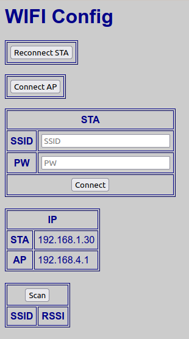

# Tracker
Camera motion with two degrees of freedom using ESP8266, two stepper motors, Canon ELPH330HS, and CHDK (Canon Hack Development Kit).

CHDK controls the camera focus and exposure, then waits for the remote trigger (a 100 mSec pulse on the USB power line) (https://chdk.fandom.com/wiki/CHDK)

The ESP8266 solves the trig problem "SOHCAHTOA":  given the Target Distance ("Opposite Side"), either increment the Camera Distance ("Adjacent Side") and calculate the Angle (`atan(Opposite/Adjacent)`), or increment the Angle and calculate the Camera Distance (`Opposite/tan(Angle)`).

The first case, **Constant Linear**, is what you see when you look out the window of a car:  distance objects slowly approach, rapidly pass, then slowly receed.

In the second case, **Constant Angular**, distant objects rapidly approach, slowly pass, then rapidly receed.  The samples here use **Constant Angular**.

When the camera has moved to position, the ESP8266 pulses the USB line to trigger the shot.

Camera horizontal motion using Actobotics "Channel Slider Kit A" (https://www.servocity.com/channel-slider-kit-a/) with a 48" channel, and a NEMA-17 stepper motor (https://www.adafruit.com/product/324).  
Panning with a 25:1 gearing and a NEMA-17 stepper motor:

Horizontal resolution is 0.38 mm/step (0.015 inches/step) with 42" of travel  
Angular resolution is 0.072 degrees/step

The entire process takes about 5 minutes for a 50 frame sequence, or about 6 seconds per frame.

#### Configure WiFi

The ESP8266 will automatically connect to the last used access point based on configuration saved in flash memory.  
If this is the first time connecting (or the access point is unavailable), this program will create a _soft access point_ with SSID: __tracker__ and Password: __carbondioxide__.
Connect with a WiFi client and browse to __http://tracker.local__ to access the program.

To configure the ESP8266 to use an existing access point, browse to __http://tracker.local/config__, and enter the SSID and PW.  The STA IP is the assigned address on the network:

The ESP8266 will automatically connect to that network on reboot.

#### Run Tracker

Load the script `chdk/track.lua` on the camera; switch to __ALT__ mode; press shutter to start.  The viewfinder will display __*** STARTED ***__:

 

On the ESP8266 web page __http://tracker.local__: 

- __Current Location__: enter the location of the camera (measured to the motor end of the camera slider), and the current camera angle.  Press __Set__.  
- __Automatic Tracking__: enter the distance from the camera slider to the target, and the number of frames.  Press __Begin__ to move the camera to the beginning position (camera should still be centered on target).  Press __Start__.

When it's done, you will have a set of images on the camera that can be converted into a stabilized GIF using  `scripts/createGIF.sh`:

